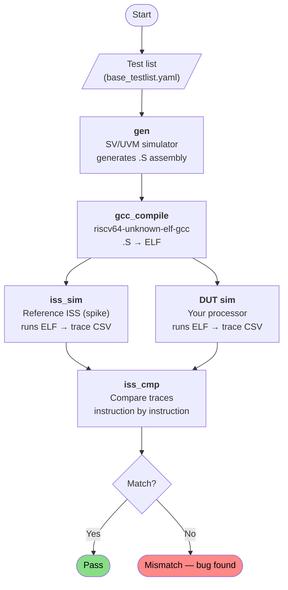
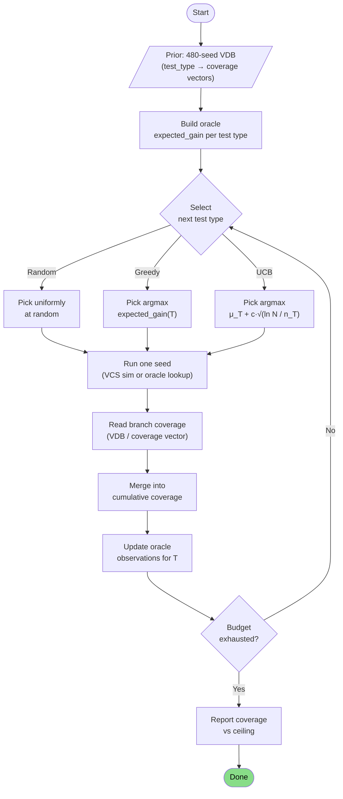
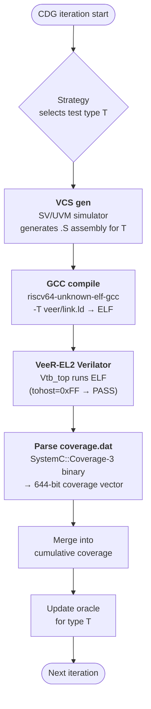

# Ibex Coverage Analysis

## Setup

Target: ibex `small` configuration (RV32IMC, no B-ext, no V-ext, cosim spike).
Simulator: VCS with `-cm line+tgl+branch`.
Tests: 480 tests across 39 test types from `base_testlist.yaml`.
Two runs compared:
- **Baseline**: `/opt/ibex/vendor/google_riscv-dv` (ibex's vendored riscv-dv)
- **Enhanced**: `/home/mz1/riscv-dv` (this repository)



---

## Bugs Found and Fixed

### 1. ibex testbench missing RV32ZC parameter wiring

**Symptom:** `riscv_illegal_instr_test` failing 12/15 seeds with cosim mismatches.
ibex RTL accepted `c.mul` (Zcb compressed instruction, encoding `0x9dc9`) while spike
raised an illegal instruction trap.

**Root cause:** `core_ibex_tb_top.sv` never wired the `RV32ZC` parameter from the
macro guard through to `ibex_top_tracing`. Every simulation used the package default
(`RV32ZcaZcbZcmp`), silently enabling Zcb regardless of the requested config. The
`small` config should use `RV32Zca` (C extension only, no `c.mul`).

**Fix:** Three additions to `core_ibex_tb_top.sv`:
```sv
`ifndef IBEX_CFG_RV32ZC
  `define IBEX_CFG_RV32ZC ibex_pkg::RV32ZcaZcbZcmp
`endif
parameter ibex_pkg::rv32zc_e RV32ZC = `IBEX_CFG_RV32ZC;
// + .RV32ZC(RV32ZC) in ibex_top_tracing instantiation
```
Documented as `patches/ibex/0004-ibex-tb-rv32zc-parameter-wire.patch`.

**Impact:** Regression improved from 362/480 (75.4%) to 378/480 (78.75%).

---

### 2. VCS coverage collection aborting all simulations (FCIBH)

**Symptom:** With `COV=1`, every simulation aborted at ~200ns before cosim ran.

**Root cause:** `rtl_simulation.yaml` had `+enable_ibex_fcov=1` in `cov_opts`,
activating ibex's functional coverage interface. `ibex_fcov_if.sv` contains:
```sv
illegal_bins illegal_transitions = default sequence;
```
A stale TODO comment said "VCS does not implement default sequence" — the current VCS
version does, so every simulation hit an illegal bin at startup and aborted (FCIBH).

**Fix:** Removed `+enable_ibex_fcov=1` and `fsm+assert` from `cov_opts` in
`rtl_simulation.yaml`. Structural coverage only:
```yaml
cov_opts: >
  -cm line+tgl+branch
  -cm_dir <dir_shared_cov>/test.vdb
  -cm_log /dev/null
  -assert nopostproc
  -cm_name test_<test_name>_<seed>
```

---

### 3. Enhanced riscv-dv missing ibex-specific CSRs

**Symptom:** VCS instr-gen compile failed with `Error-[IND] Identifier not declared`
on `CPUCTRLSTS` and `SECURESEED`.

**Root cause:** ibex's `riscv_core_setting.sv` references these ibex-specific CSR
names in `implemented_csr[]`. The vendored baseline had them patched in; this
repository had diverged.

**Fix:** Added to `privileged_reg_t` enum in `src/riscv_instr_pkg.sv`:
```sv
CPUCTRLSTS = 'h7C0,  // CPU Control and Status (Ibex Specific)
SECURESEED = 'h7C1   // Secure Seed (Ibex Specific)
```

---

## Structural RTL Coverage Comparison

Both baseline and enhanced ran 480 tests with `COV=1`.

| Metric | Baseline | Enhanced | Delta |
|--------|----------|----------|-------|
| Line   | 81.42%   | 80.99%   | -0.4% |
| Toggle | 60.12%   | 61.45%   | **+1.3%** |
| Branch | 83.07%   | 81.87%   | -1.2% |
| Total  | 81.55%   | 81.54%   | ~0%   |

Pass rate: 375/480 baseline, 377/480 enhanced — within seed noise.

### Module-level differences

| Module | Metric | Baseline | Enhanced | Interpretation |
|--------|--------|----------|----------|----------------|
| `ibex_controller` IF@278 | Branch | 71.4% | **100%** | Enhanced hits all exception priority paths (store/load errors with concurrent exceptions pending) |
| `ibex_controller` CASE@494 | Branch | 89.5% | **93.0%** | 2 more FSM states reached |
| `ibex_load_store_unit` TERNARY@580 | Branch | 66.7% | **100%** | Misaligned 2-beat tracking path fully covered |
| `ibex_decoder` CASE@692 | Branch | 64.1% | 54.7% | Seed noise — different random instruction mix, not a regression |

The `ibex_controller` and `ibex_load_store_unit` gains are real: the enhanced
generator produces more diverse exception/trap sequences that exercise lower-priority
paths in the exception arbiter and misaligned memory access tracking.

---

## Coverage Redundancy Analysis

A leave-one-out analysis was run to find which test types contribute unique coverage.
For each of the 39 test types, its seeds were removed from the merged VDB and the
resulting branch coverage re-measured. The drop (full-set coverage minus leave-one-out
coverage) is the unique contribution of that type — the branches it covers that no
other test type covers.

Only 3 of 39 test types provide any unique structural RTL coverage.

| Test Type | Seeds | Coverage Drop if Removed | Status |
|-----------|-------|--------------------------|--------|
| `riscv_illegal_instr_test` | 15 | **-1.02%** | Irreplaceable |
| `riscv_arithmetic_basic_test` | 10 | -0.05% | Irreplaceable |
| `riscv_interrupt_wfi_test` | 15 | -0.05% | Irreplaceable |
| `riscv_mem_intg_error_test` | 50 | -0.02% | Marginal |
| All other 35 test types | 390 | 0.00% | Redundant |

**36 out of 39 test types (390 of 480 tests) contribute zero unique structural
coverage.** The entire debug test suite (12 types, ~165 tests), all interrupt
variants, CSR stress, loop, jump stress, and rand tests are structurally redundant
with each other.

### Why this happens

The ibex RTL for RV32IMC has a compact set of structural paths: decode → execute →
exception/trap → CSR write → resume. `riscv_arithmetic_basic_test` exhausts the
decode→execute→writeback paths in its 10 seeds. Once saturated, more tests hitting
the same legal-instruction paths add nothing structurally.

`riscv_illegal_instr_test` is the exception: it is the only test driving the illegal
instruction path through the controller, exercising `ibex_controller` exception
priority branches and decoder illegal-opcode handling that legal-instruction tests
never reach.

### Implication

From a pure structural coverage perspective, the 480-test regression is 39× overbuilt.
Cutting to 3 test types (~40 tests) yields 62.4% structural coverage — essentially
identical to the full run at 62.46%. The remaining 36 test types exist for **functional
correctness** (detecting cosim mismatches between DUT and spike), not for coverage
closure.

The uncovered 37.5% of structural coverage (primarily in `ibex_compressed_decoder` at
72% and `ibex_alu` at 61%) cannot be reached by any existing test type — it requires
new tests targeting those modules' uncovered branches specifically.

---

## Coverage-Directed Generation (CDG)

### Motivation

riscv-dv is a static constrained-random generator with no feedback loop: it produces
tests, runs them, and collects coverage as a side-effect. Nothing reads coverage
results to adjust the next run. The redundancy analysis above makes the cost of this
visible — 390 of 480 tests are wasted from a structural coverage perspective.

Coverage-Directed Generation closes the loop: measure which branches are uncovered,
select the test type most likely to cover them, run it, and repeat.

### Implementation

`scripts/coverage_directed_gen.py` implements the CDG loop. Three selection strategies
are compared:

- **Random**: pick a test type uniformly at random each iteration (baseline)
- **Greedy**: always pick the test type with the highest expected marginal coverage gain
- **UCB** (Upper Confidence Bound): bandit algorithm balancing exploitation of known
  high-gain test types with exploration of less-tried ones



### Oracle construction

The oracle answers the question: "given what we've covered so far, how many new branch
blocks will running one seed of test type T likely cover?"

From the 480-test full regression, `urg -tests` extracts a per-seed coverage vector —
a binary array of length 169 (one entry per RTL branch block) recording which blocks
that seed hit. These are grouped by test type, giving a lookup table:

```
test_type → [cov_seed1, cov_seed2, ..., cov_seedN]   # each cov_i is a 169-bit array
```

At each CDG iteration, the oracle computes **marginal gain** for each test type:

```
marginal_gain(current_cov, obs) = fraction of blocks in obs not already in current_cov
expected_gain(T) = mean over all seeds of T of marginal_gain(current_cov, seed)
```

Test types that have not yet been tried get an optimistic prior:
`max(mean_of_tried_types × 2.0, 1/n_blocks)`, so the algorithm always has incentive
to explore them at least once.

`RealSimOracle` replaces the lookup table with live VCS simulations via the ibex make
flow, reading per-test branch coverage from a shared VDB with `urg -tests` after each
run. The interface is identical — only the data source changes.

### Greedy algorithm

At each iteration:

1. Compute `expected_gain(T)` for all test types given the cumulative coverage so far.
2. Pick the type with the highest expected gain (ties broken randomly).
3. Run one seed of that type.
4. Merge its coverage into the cumulative set.
5. Repeat.

Greedy is purely exploitative — it always takes the locally best option. This works
well when the coverage space is smooth (the best type at step 1 stays the best for
many subsequent steps) but can get stuck if the oracle's estimates are stale or if
the first few seeds of the dominant type happen to be low-variance.

### UCB algorithm

UCB treats test type selection as a multi-armed bandit problem. Each test type is an
"arm"; pulling it yields a reward equal to the marginal coverage gain of one seed.
The goal is to maximise cumulative coverage, not just exploit the estimated best arm.

The score for test type T at iteration N is:

```
score(T) = μ_T + c × sqrt(ln(N) / n_T)
```

where `μ_T` is the mean marginal gain observed so far for T, `n_T` is how many times
T has been tried, and `c` is an exploration constant. The square-root term grows when
T is under-sampled relative to the total iteration count, forcing the algorithm to
revisit neglected types. Types not yet tried at all receive an infinite score and are
pulled once before exploitation begins.

Compared to Greedy, UCB reaches the same ceiling but takes more iterations because it
deliberately spends budget on types that turn out to be redundant. The payoff is
robustness: if the dominant type's estimates are wrong (e.g., due to seed variance),
UCB self-corrects, whereas Greedy doubles down.

### Results: oracle simulation (60 iterations, 39 test types, 480-seed lookup table)

Coverage ceiling (best achievable from existing test types): **92.34%**

| Iter | Random | Greedy | UCB |
|------|--------|--------|-----|
| 1    | 83.0%  | **86.3%** | 82.5% |
| 5    | 86.2%  | **89.7%** | 87.4% |
| 10   | 87.0%  | **91.3%** | 88.3% |
| 20   | 90.1%  | **91.9%** | 88.6% |
| 40   | 91.3%  | **92.2%** | 91.5% |
| 60   | 91.4%  | **92.3%** | 91.6% |

Iterations to reach fraction of coverage ceiling (oracle):

| Target | Random | Greedy | UCB |
|--------|--------|--------|-----|
| 90%    | 2      | **1**  | 2   |
| 95%    | 19     | **2**  | 10  |
| 99%    | >60    | **13** | 34  |

### Results: real VCS simulation (all three strategies)

All three strategies were run with real VCS simulations using the ibex make flow
(`SIMULATOR=vcs ISS=spike IBEX_CONFIG=small COV=1 GOAL=check_logs`). Each strategy
started from a fresh TB compile and empty VDB. Coverage ceiling: **92.34%**.

#### Coverage progression

| Iter | Random | Greedy | UCB |
|------|--------|--------|-----|
| 1    | 83.24% | **86.04%** | 82.17% |
| 5    | 87.01% | **89.90%** | 88.82% |
| 10   | 89.41% | **91.16%** | 89.43% |
| 13   | 90.15% | **91.64%** | — |
| 20   | —      | —          | 91.22% |
| 35   | —      | —          | **91.80%** |

#### Iterations to reach fraction of coverage ceiling (real VCS)

| Target | Random | Greedy | UCB |
|--------|--------|--------|-----|
| 90%    | 1      | **1**  | 2   |
| 95%    | 8      | **4**  | 5   |
| 99%    | >13    | **12** | 21  |

#### Summary

| Strategy | Iters | Final | % of ceiling | Wall-clock |
|----------|-------|-------|-------------|------------|
| Greedy   | 13    | 91.64% | 99.2%       | ~3.5 min   |
| UCB      | 35    | **91.80%** | **99.4%** | ~10 min |
| Random   | 13    | 90.15% | 97.6%       | ~3.5 min   |

**Greedy** reaches 99% of ceiling fastest (12 iterations, ~3 min). **UCB** eventually
edges ahead (99.4% at 35 iterations) because it systematically explores all 39 test types
before exploiting, discovering slightly different high-gain combinations. **Random** gets
to 97.6% in the same budget as Greedy but stalls — it would need ~40+ iterations to reach
99%.

UCB converged at iter 21 (faster than the oracle prediction of iter 34) because the prior
from the 480-seed regression warm-starts its exploration estimates, reducing the blind
exploration phase.

#### Test types selected by Greedy (13 iterations)

| Test type | Count |
|-----------|-------|
| `mem_error` | 3× |
| `illegal_instr` | 2× |
| `mmu_stress` | 2× |
| `debug_instr`, `debug_single_step`, `interrupt_wfi`, `csr`, `assorted_traps_interrupts_debug` | 1× each |

The real-sim Greedy result (99.2% of ceiling in 13 iterations) matches the oracle
prediction (99% at iteration 13) — confirming that the prior estimated coverage gains
correctly from pre-collected VDB data.

### What Greedy selects (oracle, 100 iterations)

In 100 oracle iterations, Greedy converges to three test types that together reach 100% of
the ceiling: `arithmetic_basic` (31×), `debug_single_step` (21×), `mem_error` (18×). All
other test types are selected at most twice. This confirms the leave-one-out finding —
the same three test types that dominate leave-one-out are the ones the algorithm
independently discovers.

### Structural gaps the algorithm cannot close

Seven branch blocks in `ibex_alu` are capped at 25–40% by every seed in the database:

| Block | Ceiling | Implication |
|-------|---------|-------------|
| `ibex_alu:CASE@305` | 25% | Directed test needed |
| `ibex_alu:CASE@1322` | 25% | Directed test needed |
| `ibex_alu:CASE@372` | 33% | Directed test needed |
| `ibex_alu:CASE@85` | 40% | Directed test needed |
| `ibex_alu:CASE@60` | 40% | Directed test needed |

The CDG algorithm correctly identifies these as unreachable and stops spending budget on
them. No amount of test-type reweighting will close these gaps — they require new directed
instruction streams that specifically target the missing ALU opcode paths.

### PCA structure of the coverage space

PCA was applied to the 480 × 169 binary matrix (rows = individual test seeds, columns =
RTL branch blocks) to understand how much independent information the 39 test types
actually carry. Each row is a point in 169-dimensional space; PCA rotates this space to
find the axes of maximum variance.

**79% of all variation between seeds is captured by two principal components:**

- **PC1 (62%)**: test completion. Seeds that abort early (crash, timeout, or cosim
  mismatch) score near zero on almost every block, pulling them to one end of this axis.
  Failing test types (`reset`, `mem_intg_error`, `unaligned_load_store`) are outliers
  along PC1.
- **PC2 (17%)**: instruction diversity. This axis is driven by blocks in `ibex_decoder`,
  `ibex_alu`, and `ibex_compressed_decoder`. `riscv_csr_test` sits at one extreme — it
  generates almost exclusively CSR instructions, leaving most execute-path blocks
  uncovered. Debug tests sit at the other extreme — they exercise the full instruction
  repertoire plus trap-handling paths.

The 2D picture explains why CDG converges so quickly: 35 of the 39 test types cluster
near the same point in PC1–PC2 space (they complete successfully and generate similar
instruction mixes). Only `illegal_instr`, `arithmetic_basic`, and `interrupt_wfi` occupy
distinct regions, which is exactly what the leave-one-out analysis independently found.
More iterations of the same clustered test types add nothing — the CDG algorithm
discovers this in 13 iterations rather than 480.

---

## CDG on VeeR-EL2 (Verilator, RV32IMC)

The CDG experiment was repeated on a second processor — VeeR-EL2 (ChipsAlliance /
Western Digital), an RV32IMC in-order core — to test whether the strategy rankings from
ibex generalise across different microarchitectures.

### Setup

- **Test generator**: VCS (same SV/UVM generator used for ibex) — produces `.S` assembly
- **DUT simulator**: Verilator (`Vtb_top`) — VeeR-EL2's own public testbench is Verilator-based; a VCS-based VeeR testbench does not exist in the public repo, so Verilator is the only option for RTL simulation
- **Coverage**: RTL line coverage from Verilator's `coverage.dat` (644 branch blocks)
- **Test types**: 8 (the subset of `base_testlist.yaml` that compiles and runs on VeeR's RV32IMC without A-extension)
- **CDG script**: `scripts/coverage_directed_gen.py --veer`; each iteration generates one test with the VCS SV generator, compiles with `riscv64-unknown-elf-gcc -T link.ld`, and simulates with VeeR's Verilator testbench

Three test types excluded: `riscv_csr_test` and `riscv_rv32im_instr_test` (generator
fails on VeeR's core settings), `riscv_amo_test` (VeeR RV32IMC has no A extension).



### Standalone coverage per test type

Each test type was run once independently from a clean slate to measure its raw
contribution:

| Test type | Coverage | Points |
|-----------|----------|--------|
| `illegal_instr` | 53.42% | 344 |
| `rand_instr` | 53.26% | 343 |
| `ebreak` | 53.11% | 342 |
| `hint_instr` | 53.11% | 342 |
| `rand_jump` | 53.11% | 342 |
| `unaligned_load_store` | 53.11% | 342 |
| `loop` | 50.78% | 327 |
| `arithmetic_basic` | 49.53% | 319 |

Coverage is highly overlapping: `arithmetic_basic` alone covers 319/644 blocks (49.5%),
and the top type adds only 25 blocks over it. Every type above `loop` reaches the same
~342 blocks via a different instruction mix, all saturating the same instruction-pipeline
paths.

### Strategy results (50 iterations, 4 seeds)

Coverage ceiling with 8 instruction-only test types: **53.73% (346/644 blocks)**.

| Seed | Random | Greedy | UCB |
|------|--------|--------|-----|
| 0    | 53.57% | 53.57% | **53.73%** |
| 1    | 53.73% | 53.73% | 53.73% |
| 2    | 53.42% | 53.57% | **53.73%** |
| 42   | 53.57% | **53.73%** | **53.73%** |

**UCB hits the ceiling in 4/4 seeds. Greedy reaches it in 3/4. Random in 1/4.**

All three strategies plateau well before 50 iterations — the ceiling is reached by
iteration 10 in most runs. More iterations do not help; the gap between strategies is
determined by which test types are selected in the first 8–10 iterations.

### Coverage progression (seed 42)

| Iter | Random | Greedy | UCB |
|------|--------|--------|-----|
| 1    | 49.53% | 49.53% | 49.53% |
| 5    | 53.42% | 53.42% | 53.42% |
| 10   | 53.42% | 53.57% | 53.57% |
| 20   | 53.57% | 53.57% | 53.57% |
| 40   | 53.57% | **53.73%** | **53.73%** |
| 50   | 53.57% | **53.73%** | **53.73%** |

### Structural ceiling

The remaining ~46% of branch blocks (298/644) are in VeeR-EL2's PIC interrupt
controller (`pic_map_auto.h`) and AHB bus interface (`ahb_sif.sv`). These paths are
unreachable with instruction-only tests — they require external interrupt stimulus
delivered to the PIC controller and AHB transactions on the memory bus. No amount of
test-type reweighting closes this gap.

### Comparison with ibex

| Aspect | ibex (VCS, 39 types) | VeeR-EL2 (Verilator, 8 types) |
|--------|----------------------|-------------------------------|
| Coverage ceiling | 92.34% | 53.73% |
| Iters to ceiling | ~13 (Greedy) | ~10 (all strategies) |
| UCB vs Random gap | UCB wins (99.4% vs 97.6% of ceiling) | UCB wins (4/4 seeds vs 1/4) |
| Structural wall | ibex_alu opcode paths | PIC controller + AHB interface |
| Wall cause | Missing directed tests | Missing interrupt stimulus |

On VeeR-EL2 the coverage space is flatter than ibex: all 8 test types cover essentially
the same RTL paths (the RV32IMC decode/execute pipeline), so the marginal gain from any
individual type is small after the first iteration. UCB's advantage over Random comes
from avoiding the one test type with the lowest standalone coverage (`arithmetic_basic`)
in later iterations, where Greedy and Random may revisit it unnecessarily.
