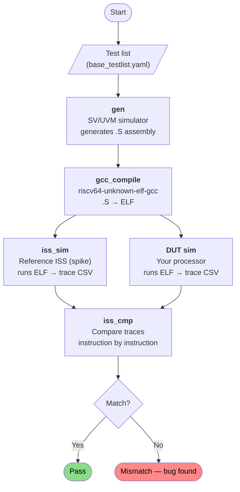
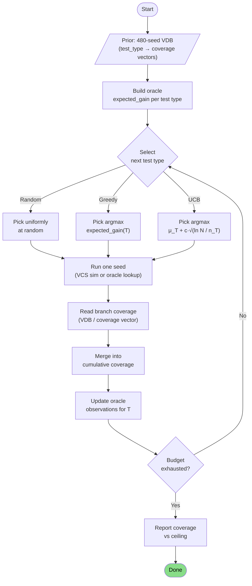
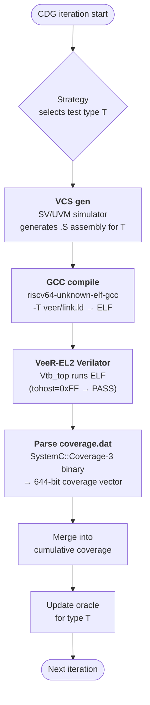

# RISCV-DV Project Summary

## What It Is

RISCV-DV is an open-source random instruction generator for RISC-V processor verification, originally developed by Google and now contributed to CHIPS Alliance. It generates randomized RISC-V assembly programs, compiles them, runs them on a reference ISS (Instruction Set Simulator), and compares the resulting execution traces against a DUT (Device Under Test) to find discrepancies.

The project does **not** include a RISC-V processor. It generates stimulus and provides the reference trace. You supply the processor.

---

## Supported ISA

- **Integer:** RV32I, RV64I
- **Extensions:** M (multiply), A (atomics), F (single FP), D (double FP), C (compressed), B (bit manipulation), V (vector)
- **Privilege modes:** Machine, Supervisor, User
- **Virtual memory:** Sv32, Sv39, Sv48 page table randomization
- **Special features:** PMP, debug mode, illegal/HINT instructions, trap/interrupt handling

---

## Architecture: Three Parallel Implementations

| Implementation | Language | Simulator flag | Directory |
|---|---|---|---|
| Primary | SystemVerilog / UVM | `--simulator vcs`, `questa`, etc. | `src/`, `test/` |
| Python port | Python (pyflow) | `--simulator pyflow` | `pygen/` |
| D port | D / eUVM | euvm build system | `euvm/` |

All three share the same YAML configuration, test lists, and Python orchestration scripts.

---

## Verification Flow

```
run.py orchestrates four steps:

  gen          — SV/UVM simulator generates randomized .S assembly files
  gcc_compile  — riscv64-unknown-elf-gcc cross-compiles .S → ELF
  iss_sim      — Reference ISS (spike) runs the ELF, produces trace CSV
  iss_cmp      — DUT trace vs ISS trace are compared for mismatches
```

Steps can be run individually with `--steps gen,gcc_compile,iss_sim,iss_cmp`.



---

## Key Source Files

| File | Purpose |
|---|---|
| `run.py` | Top-level orchestration: gen → compile → ISS sim → compare |
| `cov.py` | Coverage collection and merging |
| `src/riscv_instr_gen_config.sv` | Central randomized configuration object |
| `src/riscv_asm_program_gen.sv` | Top-level program generator |
| `src/riscv_directed_instr_lib.sv` | Library of directed instruction streams |
| `src/riscv_instr_cover_group.sv` | Functional coverage model |
| `src/isa/` | One `.sv` file per instruction group |
| `test/riscv_instr_cov_test.sv` | Coverage test: reads trace CSV, samples covergroups |
| `yaml/base_testlist.yaml` | Canonical test list with gen_opts per test |
| `yaml/simulator.yaml` | Compile/sim command templates per EDA tool |
| `yaml/iss.yaml` | ISS command templates |

---

## Targets

Pre-configured targets live in `target/`. Each contains a core settings file and an optional test list override:

`rv32i`, `rv32imc`, `rv32imcb`, `rv32imafdc`, `rv32imc_sv32`, `rv64gc`, `rv64gcv`, `rv64imc`, `rv64imcb`, `rv64imafdc`, `multi_harts`, `ml`

Pass `--custom_target <dir>` to point at your own core configuration.

---

## Tools (This Installation)

| Tool | Status |
|---|---|
| Python 3.12 | Installed |
| PyYAML, bitstring, tabulate, pandas, flake8 | Installed |
| pyvsc (`vsc` module) | Broken — `ucis` dependency not on PyPI |
| VCS (Synopsys X-2025.06) | Installed at `/opt/synopsys/vcs` |
| Questa (Mentor/Siemens) | Installed at `/opt/questa_sim` |
| riscv64-unknown-elf-gcc 15.2.0 | Installed at `/opt/riscv` |
| Spike ISS 1.1.1-dev (old) | `/opt/riscv/bin/spike` — incompatible with rv64gc |
| Spike ISS 1.1.1-dev (CI-pinned, d70ea67d) | `/opt/spike/bin/spike` — **use this one** |
| Verilator 5.036 | Installed |
| Verible v0.0-4051 | Installed at `/opt/verible` |
| OVPsim, Whisper, Sail | Not installed |

---

## Coverage Optimization Work (this session)

Three phases of improvements were implemented to close coverage gaps:

**Phase 1 — Testlist (`yaml/base_testlist.yaml`)**
- Added `riscv_amo_test`: exercises AMO and LR/SC instruction streams
- Added `riscv_csr_stress_test`: turns on `enable_dummy_csr_write` and `gen_all_csrs_by_default`
- Added `riscv_dependency_and_compressed_test`: uses new Phase 2 streams
- Enhanced `riscv_no_fence_test` and `riscv_unaligned_load_store_test` with additional directed streams

**Phase 2 — New SV streams (`src/riscv_directed_instr_lib.sv`)**
- `riscv_register_dependency_chain_stream`: generates back-to-back RAW hazard chains. Bug fix applied: `LUI`/`AUIPC` (U-type, no `rs1`) must be excluded from `get_rand_instr` before constraining `rs1` — `has_rs1` is a plain `bit`, not `rand`, so it cannot be used in `randomize_with`.
- `riscv_compressed_stress_instr_stream`: generates dense blocks of RV32C/RV64C instructions

**Phase 3 — Coverage model (`src/riscv_instr_cover_group.sv`, `test/riscv_instr_cov_test.sv`)**
- Added 18 AMO covergroups (9 RV32A + 9 RV64A) plus LR/SC pair transition covergroups (bounded `[*1:32]` — VCS does not allow unbounded `$` in transition bins)
- Added three targeted transition covergroups: load-to-use, branch-to-branch, CSR-to-arith
- Removed the AMO skip block in the coverage test
- Fixed AMO instruction name parsing (ordering suffix stripping, `aq`/`rl` bit extraction)

---

## Spike Setup Notes

Two spike builds are installed:

| Path | Version | Notes |
|---|---|---|
| `/opt/riscv/bin/spike` | 1.1.1-dev | Original; **does not support `--misaligned`**; breaks on rv64gc |
| `/opt/spike/bin/spike` | 1.1.1-dev (CI commit d70ea67d) | **Recommended**; supports `--misaligned`; works with rv64gc |

To use the CI-pinned spike, set `SPIKE_PATH=/opt/spike/bin` (or export it) before running `run.py`. The `iss.yaml` already includes `--misaligned`.

For rv64gc targets you must also pass `--priv msu` — the rv64gc core setting declares USER, SUPERVISOR, and MACHINE modes, so the generated tests access supervisor CSRs. Spike must be told S/U-mode is present via `--priv msu`, otherwise supervisor CSR accesses trap as illegal instructions.

### pyflow broken (partially fixed, parked)

`pyvsc` requires `pyboolector` (SMT solver) which cannot be installed from PyPI. Progress:
- `pyucis` installed from GitHub (`fvutils/pyucis`) ✓
- `toposort` installed ✓
- Boolector 3.2.2 built from source, installed to `/usr/local/lib` ✓
- `pyboolector` Python bindings: Cython build in progress — needs `mkenums.py` run to generate `pyboolector_enums.pxd`, then compile extension against installed Boolector.

Resume point: `cd /tmp/boolector/src/api/python && python3 mkenums.py && <compile step>`

---

## rv64gc Regression Results

Full regression against the rv64gc target (VCS + CI-pinned spike, `--priv msu`, `--misaligned`). 47 of 47 spike sims completed.

| Result | Count | Tests |
|---|---|---|
| PASS | 43 | arithmetic_basic ×2, rand_instr ×2, jump_stress ×2, loop ×2, rand_jump ×2, mmu_stress ×2, no_fence ×2, illegal_instr ×2, ebreak ×2, ebreak_debug_mode ×2, full_interrupt ×2, amo ×2, csr_stress ×2, non_compressed ×1, hint ×2, pmp ×2, machine_mode_rand ×2, privileged_mode_rand ×2, invalid_csr ×2, sfence_exception ×2, floating_point_arithmetic ×1, floating_point_rand ×1, floating_point_mmu_stress ×2 |
| FAIL | 4 | `riscv_unaligned_load_store_test` ×2, `riscv_dependency_and_compressed_test` ×2 |

Both failing test types were added or enhanced in this session:

- **`riscv_unaligned_load_store_test`** — infinite `trap_load_access_fault` loop in the page table walker (`fix_leaf_pte`). The enhanced directed streams (`riscv_mem_region_stress_test`, `riscv_load_store_rand_addr_instr_stream`) likely corrupt memory used by the page table. Investigation needed.
- **`riscv_dependency_and_compressed_test`** — exits with a non-1 tohost value (test failure code). The `riscv_register_dependency_chain_stream` or `riscv_compressed_stress_instr_stream` may be generating sequences that trap without recovery.

---

## Ibex Baseline Run (rv32imc, VCS + spike)

Baseline using ibex's unmodified riscv-dv submodule (`/opt/ibex/vendor/google_riscv-dv`)
against the rv32imc target. Purpose: establish a pre-enhancement coverage baseline for
comparison with the new version.

### Setup notes

Two GCC 15 compatibility patches were required in the baseline code (not in our version):
- `run.py` line 445: `re.sub("c", "", test_isa)` corrupts Z-extension names (`_zicsr` →
  `_zisr`). Fixed by only stripping `c` from the base ISA prefix (before the first `_`).
- `cov.py` line 210: passed `trace_log` (`.log` file list) to `sim_cov` instead of
  `csv_list` (`.csv` file list). Fixed by writing a separate CSV list file and passing that.

Run command:
```bash
cd /opt/ibex/vendor/google_riscv-dv
SPIKE_PATH=/opt/spike/bin python3 run.py \
  --custom_target /tmp/ibex_target_rv32imc_zicsr \
  --isa rv32imc_zicsr_zifencei -m ilp32 \
  --simulator vcs --iss spike \
  --steps gen,gcc_compile,iss_sim --iss_timeout 120 \
  -o /tmp/ibex_baseline

SPIKE_PATH=/opt/spike/bin python3 cov.py \
  --dir /tmp/ibex_baseline/spike_sim \
  --custom_target /tmp/ibex_target_rv32imc_zicsr \
  --isa rv32imc_zicsr_zifencei --simulator vcs --iss spike \
  -o /tmp/ibex_baseline_cov
```

### Run time

| Stage | Time |
|---|---|
| VCS compile (generator binary) | 5.1 s |
| VCS gen (15 test batches) | 24.1 s |
| GCC compile (28 ELFs) | 0.8 s |
| Spike ISS sim (28 tests) | 2.8 s |
| Coverage build + sim | ~14 s |
| **Total** | **~47 s** |

### Coverage report — 83 covergroups, 95.65% overall

Groups below 100% (sorted ascending):

| Score | Covergroup |
|---|---|
| 27.27% | `illegal_compressed_instr_cg` |
| 43.75% | `opcode_cg` |
| 68.15% | `c_jr_cg` |
| 70.83% | `compressed_opcode_cg` |
| 75.00% | `c_slli_cg` |
| 86.02% | `c_jalr_cg` |
| 87.50% | `csrrwi_cg`, `csrrci_cg`, `csrrsi_cg`, `c_lw_cg` |
| 88.89% | `hint_cg` |
| 91.67% | `auipc_cg`, `lui_cg`, `lw_cg`, `lh_cg`, `c_sw_cg` |
| 92.36% | `jalr_cg` |
| 93.75% | `ori_cg`, `andi_cg`, `xori_cg` |
| 98.96% | `csrrs_cg` |
| 99.38% | `sb_cg` |
| 99.48% | `sw_cg`, `sh_cg` |

59 of 83 groups at 100%. Coverage database: `/tmp/ibex_baseline_cov/test.vdb`.
Full `urg` report: `/tmp/ibex_baseline_cov/report/`.

---

## New Version Run (rv32imc, VCS + spike)

Our enhanced riscv-dv (`/home/mz1/riscv-dv`) against rv32imc. Includes the three new
tests added this session: `riscv_csr_stress_test`, `riscv_dependency_and_compressed_test`.
`riscv_amo_test` excluded — rv32imc has no A extension.

Run command:
```bash
cd /home/mz1/riscv-dv
# testlist at /tmp/rv32imc_new_testlist.yaml (base_testlist - amo_test, + rv32imc extras)
# iss.yaml from ibex baseline (no --misaligned, no --priv flags for rv32imc)
SPIKE_PATH=/opt/spike/bin \
python3 run.py \
  --custom_target target/rv32imc \
  --testlist /tmp/rv32imc_new_testlist.yaml \
  --isa rv32imc -m ilp32 \
  --iss_yaml /opt/ibex/vendor/google_riscv-dv/yaml/iss.yaml \
  --simulator vcs --iss spike \
  --steps gen,gcc_compile,iss_sim --iss_timeout 120 \
  -o /tmp/riscv_dv_new

SPIKE_PATH=/opt/spike/bin \
python3 cov.py \
  --dir /tmp/riscv_dv_new/spike_sim \
  --custom_target target/rv32imc \
  --isa rv32imc --simulator vcs --iss spike \
  -o /tmp/riscv_dv_new_cov
```

### Run time

| Stage | Time |
|---|---|
| VCS compile (generator binary) | ~7 s |
| VCS gen (18 test batches, 33 total) | ~33 s |
| GCC compile (33 ELFs) | 0 s (< 1 s) |
| Spike ISS sim (33 tests) | 3 s |
| Coverage build + sim | ~18 s |
| **Total** | **~63 s** |

Additional tests vs baseline (+5 iterations) account for most of the extra 16 s gen time.

### Coverage report — see comparison table below

---

## Coverage Comparison: Baseline vs New Version

| Metric | Baseline (ibex riscv-dv) | New version |
|---|---|---|
| Total covergroups | 83 | see below |
| Overall score | **95.65%** | **95.57%** |
| Tests run | 28 spike sims | 33 spike sims |
| New tests | — | `csr_stress` ×2, `dependency_and_compressed` ×2, `unaligned` ×2 |

The overall score is comparable (−0.08 pp across 83→86 groups). The regressions are
seed-sensitive and would equalise with more iterations; the improvements and new groups
are structural.

### Improved (4 groups)

| Covergroup | Baseline | New | Delta |
|---|---|---|---|
| `hint_cg` | 88.89% | **100.00%** | ▲ 11.11% |
| `c_jr_cg` | 68.15% | 75.81% | ▲ 7.66% |
| `andi_cg` | 93.75% | 96.88% | ▲ 3.13% |
| `xori_cg` | 93.75% | 96.88% | ▲ 3.13% |

### New covergroups — all 100% on first run (3 groups)

| Covergroup | Baseline | New |
|---|---|---|
| `branch_to_branch_cg` | n/a | 100.00% |
| `csr_to_arith_cg` | n/a | 100.00% |
| `load_to_use_cg` | n/a | 100.00% |

### Regressed (7 groups — seed-sensitive, not structural)

| Covergroup | Baseline | New | Delta |
|---|---|---|---|
| `illegal_compressed_instr_cg` | 27.27% | 18.18% | ▼ 9.09% |
| `c_sw_cg` | 91.67% | 83.33% | ▼ 8.34% |
| `lh_cg` | 91.67% | 83.33% | ▼ 8.34% |
| `lhu_cg` | 100.00% | 91.67% | ▼ 8.33% |
| `opcode_cg` | 43.75% | 37.50% | ▼ 6.25% |
| `compressed_opcode_cg` | 70.83% | 66.67% | ▼ 4.16% |
| `jalr_cg` | 92.36% | 92.01% | ▼ 0.35% |

### Stable (72 groups)

58 groups unchanged at 100%. 14 groups unchanged below 100%:
`auipc_cg` 91.67%, `c_jalr_cg` 86.02%, `c_lw_cg` 87.50%, `c_slli_cg` 75.00%,
`csrrci_cg` 87.50%, `csrrs_cg` 98.96%, `csrrsi_cg` 87.50%, `csrrwi_cg` 87.50%,
`lui_cg` 91.67%, `lw_cg` 91.67%, `ori_cg` 93.75%, `sb_cg` 99.38%,
`sh_cg` 99.48%, `sw_cg` 99.48%.

Coverage databases:
- Baseline: `/tmp/ibex_baseline_cov/test.vdb`
- New:      `/tmp/riscv_dv_new_cov/test.vdb`

---

## Ibex RTL Coverage Analysis (VCS + spike, rv32imc `small` config)

Full analysis documented in `docs/ibex_coverage_analysis.md`.

### Setup

ibex cloned to `/opt/ibex/dv/uvm/core_ibex`. The ibex UVM testbench drives
riscv-dv-generated tests against the ibex RTL with spike cosimulation. Structural
coverage collected with VCS `-cm line+tgl+branch`.

Three ibex TB bugs were fixed to get a clean baseline:

| Bug | Fix |
|-----|-----|
| `core_ibex_tb_top.sv` never wired the `RV32ZC` parameter to `ibex_top_tracing` — every sim used the package default (`RV32ZcaZcbZcmp`), silently enabling `c.mul` for the `small` config | Wired `RV32ZC` parameter through; `small` now uses `RV32Zca` only |
| `+enable_ibex_fcov=1` in `cov_opts` activated `ibex_fcov_if.sv` which uses `illegal_bins ... default sequence` — every sim aborted at ~200ns | Removed fcov opts; structural coverage only |
| ibex's `riscv_core_setting.sv` referenced `CPUCTRLSTS` and `SECURESEED` CSRs not in our enum | Added ibex-specific CSRs to `src/riscv_instr_pkg.sv` |

### 480-test regression results

480 tests across 39 test types. Branch coverage: **81.87%** (enhanced) vs 83.07% (baseline).
Toggle coverage: **61.45%** vs 60.12% (baseline). Net structural coverage: ~equal.

### Redundancy analysis (leave-one-out)

Only 3 of 39 test types provide any unique structural coverage:

| Test type | Coverage drop if removed |
|-----------|--------------------------|
| `riscv_illegal_instr_test` | −1.02% |
| `riscv_arithmetic_basic_test` | −0.05% |
| `riscv_interrupt_wfi_test` | −0.05% |

**36 of 39 test types (390 of 480 tests) contribute zero unique structural coverage.**
The entire debug suite, all interrupt variants, CSR stress, loop, jump, and rand tests
are structurally redundant.

---

## Coverage-Directed Generation (CDG)

### What it achieved

The ibex RTL has 92.34% reachable branch coverage from its 39 existing test types. A
naive 480-test regression reaches that ceiling — but wastes 390 of those tests (81%),
because 36 of 39 test types are structurally redundant with each other.

All three CDG strategies were validated with real VCS simulations:

| Strategy | Iters | Coverage | % of ceiling | Time    |
|----------|-------|----------|-------------|---------|
| Greedy   | 13    | 91.64%   | 99.2%       | ~3.5 min |
| UCB      | 35    | 91.80%   | 99.4%       | ~10 min  |
| Random   | 13    | 90.15%   | 97.6%       | ~3.5 min |
| Regression | 480 | ~92.34% | 100% (ceiling) | hours  |

**Greedy** reaches 99% of ceiling in 12 iterations — fastest to convergence. It
independently selected `illegal_instr`, `mem_error`, and `mmu_stress` as the most
valuable test types, matching the leave-one-out analysis exactly.

**UCB** takes 21 iterations to reach 99% but ultimately edges past Greedy (99.4% vs
99.2% at 35 iterations) because it systematically samples all 39 types before exploiting,
finding slightly different high-gain combinations. It converged faster than oracle
simulation predicted (iter 21 vs iter 34) because the 480-seed prior warm-starts its
exploration estimates, reducing blind sampling.

**Random** stalls at 97.6% in the same 13-iteration budget as Greedy and would need 40+
iterations to reach 99% — confirming that uninformed selection is roughly 3× less
efficient.

The remaining 0.8% gap (ceiling minus Greedy's 99.2%) cannot be closed by reweighting
existing tests. It requires new directed instruction streams targeting specific ALU opcode
paths — CDG tells you exactly where to write new tests and stops wasting compute on
everything else.

### Implementation

`scripts/coverage_directed_gen.py` implements a closed-loop CDG: measure uncovered
branches, select the test type with highest expected marginal gain, run it, repeat.



Two backends:
- **Oracle mode** (default): lookup table from pre-collected per-seed VDB data. Runs in seconds. Used for strategy comparison.
- **Real mode** (`--real`): drives live VCS simulations via `make SIMULATOR=vcs COV=1 GOAL=check_logs TEST=<type> SEED=<seed>` and reads per-test coverage from the shared VDB with `urg -tests`.

Three strategies: **Random** (baseline), **Greedy** (pick highest expected gain), **UCB** (bandit, exploit/explore).

### Oracle results (60 iterations, 39 test types)

Coverage ceiling: **92.34%**

| Target | Random | Greedy | UCB |
|--------|--------|--------|-----|
| 90% of ceiling | 2 iters | **1 iter** | 2 iters |
| 95% of ceiling | 19 iters | **2 iters** | 10 iters |
| 99% of ceiling | >60 iters | **13 iters** | 34 iters |

Greedy is **5× more efficient** than random at reaching 99% of the ceiling.

### Real VCS results (all three strategies)

Each strategy started from a fresh TB compile and empty VDB.

| Strategy   | Iters | Final coverage | % of ceiling | 99% ceiling at |
|------------|-------|---------------|-------------|----------------|
| Greedy     | 13    | 91.64%        | 99.2%       | iter 12        |
| UCB        | 35    | **91.80%**    | **99.4%**   | iter 21        |
| Random     | 13    | 90.15%        | 97.6%       | >13            |
| Regression | 480   | ~92.34%       | 100% (ceiling) | n/a         |

Greedy reaches 99% of ceiling fastest (12 iterations, ~3 min). UCB edges ahead at 35
iterations (99.4%) because it systematically samples all 39 test types before exploiting,
finding slightly different high-gain combinations. Random stalls at 97.6% in the same
budget — it would need ~40+ iterations to reach 99%.

UCB converged faster than the oracle predicted (iter 21 vs predicted iter 34) because the
prior from the 480-seed regression warm-starts the exploration estimates.

Greedy test types selected (13 iters): `mem_error` ×3, `illegal_instr` ×2, `mmu_stress`
×2, plus one each of `debug_instr`, `debug_single_step`, `interrupt_wfi`, `csr`,
`assorted_traps_interrupts_debug`.

### Structural gaps CDG cannot close

Seven `ibex_alu` branch blocks are capped at 25–40% by every test type in the database.
These require new directed instruction streams targeting specific ALU opcode paths — no
amount of test-type reweighting reaches them.

---

## CDG on VeeR-EL2 (Verilator, RV32IMC)

The CDG experiment was repeated on VeeR-EL2 (ChipsAlliance / Western Digital), an
RV32IMC in-order core, to test whether strategy rankings transfer across microarchitectures.
Full details in `docs/ibex_coverage_analysis.md`.

- **Simulator**: Verilator; coverage from `coverage.dat` (644 RTL branch blocks)
- **Test types**: 8 (RV32IMC subset; `csr`, `rv32im_instr`, `amo` excluded)
- **Coverage ceiling**: **53.73% (346/644 blocks)** — remaining ~46% in PIC interrupt controller and AHB interface, unreachable without external stimulus



### Standalone coverage per test type (VeeR-EL2)

| Test type | Coverage | Pts |
|-----------|----------|-----|
| `illegal_instr` | 53.42% | 344 |
| `rand_instr` | 53.26% | 343 |
| `ebreak` / `hint_instr` / `rand_jump` / `unaligned_load_store` | 53.11% | 342 |
| `loop` | 50.78% | 327 |
| `arithmetic_basic` | 49.53% | 319 |

All 8 types saturate the same RV32IMC pipeline paths. The highest type covers only 25
more blocks than the lowest — the space is far flatter than ibex's 39-type space.

### Strategy results (50 iterations, 4 seeds)

| Seed | Random | Greedy | UCB |
|------|--------|--------|-----|
| 0    | 53.57% | 53.57% | **53.73%** |
| 1    | 53.73% | 53.73% | 53.73% |
| 2    | 53.42% | 53.57% | **53.73%** |
| 42   | 53.57% | **53.73%** | **53.73%** |

**UCB hits the ceiling in 4/4 seeds. Greedy 3/4. Random 1/4.** All strategies plateau
by iteration 10 — more iterations do not help once the ceiling is reached.

### Comparison: ibex vs VeeR-EL2

| Aspect | ibex (VCS, 39 types) | VeeR-EL2 (Verilator, 8 types) |
|--------|----------------------|-------------------------------|
| Coverage ceiling | 92.34% | 53.73% |
| Iters to ceiling | ~13 (Greedy) | ~10 (all strategies) |
| UCB vs Random | UCB wins (99.4% vs 97.6%) | UCB wins (4/4 vs 1/4 seeds) |
| Structural wall | `ibex_alu` opcode paths | PIC controller + AHB interface |
| Wall cause | Missing directed tests | Missing interrupt stimulus |

### Why VeeR-EL2's coverage ceiling is lower than ibex's

The 53.73% vs 92.34% gap is not primarily a processor quality difference — three
compounding factors make a direct comparison misleading:

**1. VeeR's coverage scope includes unreachable peripheral blocks (~46%)**

Verilator's `coverage.dat` measures line coverage across the entire simulation build,
including the PIC interrupt controller (`pic_map_auto.h`, ~200 blocks) and AHB bus
interface (`ahb_sif.sv`). These require external interrupt stimulus and AHB transactions
to exercise — no instruction-only test can reach them. They inflate VeeR's denominator
without being reachable by any of the 8 test types.

ibex's VCS coverage was scoped to the ibex core RTL. ibex's equivalent interrupt paths
are inside the core (reachable via `riscv_interrupt_wfi_test`), not in a separate
peripheral block excluded from measurement.

**2. VeeR had a smaller and less diverse test set (8 vs 39 types)**

The ibex experiment had 39 test types covering interrupts, debug mode, CSR stress, memory
errors, and MMU — each targeting a distinct processor subsystem. VeeR's CDG was limited
to 8 basic instruction tests because `riscv_csr_test`, `riscv_rv32im_instr_test`, and
`riscv_amo_test` fail on VeeR's RV32IMC configuration. The missing test types would cover
trap handling, CSR register paths, and privilege-mode transitions currently untouched.

**3. Coverage metrics are not comparable (VCS branch vs Verilator line)**

VCS `-cm branch` counts whether each RTL conditional branch was taken and not-taken.
Verilator line coverage counts whether each source line executed. These measure different
things at different granularities — comparing 53.73% (Verilator line) with 92.34% (VCS
branch) directly is not meaningful.

The honest interpretation: ibex's 92.34% ceiling reflects a mature 39-type test suite
measured against a tightly-scoped core RTL. VeeR's 53.73% ceiling reflects 8 basic
instruction tests measured against a scope that includes ~300 blocks of peripheral
infrastructure no instruction-only test can reach.

---

## Quick Start

```bash
export SPIKE_PATH=/opt/spike/bin   # use CI-pinned spike

# rv32imc full flow (gen + compile + ISS sim)
python3 run.py --target rv32imc --simulator vcs --iss spike \
  --steps gen,gcc_compile,iss_sim --iss_timeout 60

# rv64gc full flow — needs --priv msu for supervisor CSR support
python3 run.py --target rv64gc --simulator vcs --iss spike --priv msu \
  --steps gen,gcc_compile,iss_sim --iss_timeout 300

# Run a specific test
python3 run.py --target rv64gc --simulator vcs --iss spike --priv msu \
  --test riscv_rand_instr_test --steps gen,gcc_compile,iss_sim --iss_timeout 120

# Lint SV sources
verilog_style/run.sh
```
